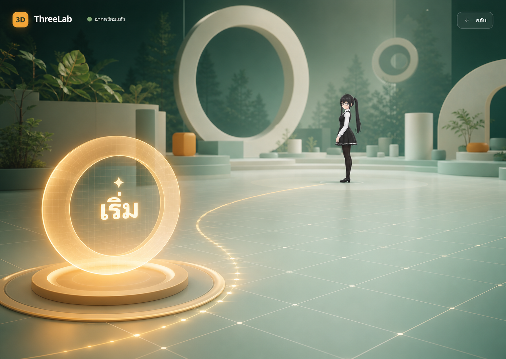

# Mona 3D Experience — Phase 1 Design

Date: 2026-07-22

Status: Approved for implementation planning

## Summary

Phase 1 replaces the root page with the smallest useful vertical slice of a future 3D-first ThreeLab experience. The app loads the real `Mona.vrm`, reports honest progress, reveals a spatial start control only after the avatar is ready, and enters a static Three.js scene with Mona standing at a distance.

This milestone intentionally stops before camera choreography, animated turning, idle motion, OrbitControls, lesson integration, audio, lip sync, or AI assistant behavior. Its purpose is to prove the loading, rendering, state, error, and UI foundations that those later features require.

## Product Direction

ThreeLab will evolve from a conventional learning dashboard into a hybrid 3D product:

- Three.js owns the persistent world, Mona, lighting, scene objects, and future camera choreography.
- React and HTML own readable text, controls, loading/error feedback, routing, keyboard access, and future lesson panels.
- Mona is intended to become a persistent in-product assistant rather than a one-off model viewer.
- Existing lesson, progress, and sandbox work is preserved for later reintegration.

The selected visual direction is concept 3: the scene itself acts as the primary interface. A warm amber start marker sits inside a pale-mint and forest-green Three.js world, with Mona waiting in the distance. The generated concept image is art direction only; the implementation uses the real VRM asset and does not need to reproduce every environmental object shown in the image.



## Goals

- Make `/` a full-viewport 3D experience shell.
- Load and parse the real VRM 1.0 avatar before enabling entry.
- Show truthful loading progress and a recoverable error state.
- Keep one Three.js canvas alive for the whole Phase 1 experience.
- Reveal a spatially styled start control only when the scene is ready.
- On Start, fade the entry UI and reveal the prepared scene with Mona standing at a distance.
- Apply a static neutral standing pose so the avatar is not shown in its bind T-pose.
- Establish extension points for later camera and character controllers without implementing their behaviors yet.
- Keep existing lesson-related routes and source files intact.

## Non-goals

- Camera dolly or spline choreography.
- Mona turning toward the viewer.
- Idle animation, breathing, gestures, or procedural motion.
- User-controlled OrbitControls.
- Voice, sound, lip sync, or AI chat.
- Lesson UI redesign or lesson-to-scene transitions.
- Multiple environments or scene navigation.
- Heavy post-processing, dynamic shadows, or complex environmental assets.
- Permanent optimization or conversion of the source VRM.

## User Experience

### 1. Loading

- The root route opens directly into the experience shell.
- A minimal ThreeLab loading overlay uses the existing forest, mint, and amber design language.
- The app reports progress while downloading and parsing `Mona.vrm` and preparing the initial scene.
- The Start control is not interactive or visible before readiness.
- The page never shows a blank canvas without explanation.

### 2. Ready

- The real Three.js scene is already rendered behind the overlay.
- Mona is placed far from the camera at a three-quarter side angle.
- A static neutral standing pose lowers the arms from the bind T-pose without adding animation.
- The amber spatial Start marker appears.
- The UI clearly says the scene is ready.

### 3. Entering

- A single Start activation begins the transition.
- The loading/ready overlay fades away.
- The spatial Start marker fades or de-emphasizes.
- Duplicate activation is ignored.

### 4. Entered

- The full scene remains visible.
- Mona remains static in the neutral standing pose at a distance.
- No camera motion or user camera control is enabled in this phase.
- This is the terminal state for the first implementation slice.

### 5. Error

- A failed network request, parse error, WebGL initialization error, or unsupported runtime results in a clear error message.
- A Retry control returns the experience to `loading` and creates a fresh load attempt.
- The error state does not require a page refresh.

## Experience State Model

The Phase 1 state model is deliberately small:

```text
loading -> ready -> entering -> entered
   |
   +------> error -> loading
```

Expected events:

- `LOAD_PROGRESS(progress)` updates visible progress while remaining in `loading`.
- `LOAD_SUCCEEDED` transitions from `loading` to `ready`.
- `LOAD_FAILED(error)` transitions from `loading` to `error`.
- `START_REQUESTED` transitions from `ready` to `entering` once.
- `ENTRY_TRANSITION_FINISHED` transitions from `entering` to `entered`.
- `RETRY_REQUESTED` transitions from `error` to a fresh `loading` attempt.

Invalid or duplicate events are ignored rather than creating inconsistent UI.

## Architecture

### React layer

`ExperiencePage`

- Owns the root page composition.
- Renders the experience shell rather than the existing dashboard shell.
- Does not delete or rewrite existing lesson pages.

`ExperienceShell`

- Keeps the canvas and UI overlay as sibling layers.
- Owns the state model and coordinates loader/runtime events with React UI.
- Provides future insertion points for lesson overlays without coupling them to the renderer.

`ExperienceOverlay`

- Renders the loading, ready, entering, and error UI.
- Exposes accessible HTML controls for Start and Retry.
- May visually align the Start button with a Three.js marker, but the accessible control remains DOM-based.

### Three.js layer

`ExperienceCanvas`

- React lifecycle adapter responsible for mounting and disposing the runtime once.
- Does not contain scene business logic.

`ExperienceRuntime`

- Owns the Three.js scene, camera, renderer, resize behavior, render loop, and resource disposal.
- Is separate from the current primitive-oriented `SandboxRuntime`.
- Exposes narrow callbacks for progress, ready, and error states.

`MonaLoader`

- Uses a VRM-aware loader integration to preserve MToon, humanoid bones, expressions, LookAt, and spring-bone data.
- Reports load progress where the browser exposes total byte counts.
- Resolves only after the VRM is parsed and attached safely to the scene.

`MonaController` placeholder

- Applies the initial transform and static standing pose.
- Owns the avatar reference so later phases can add turn, idle, expressions, and look-at behavior without moving that logic into React.
- Does not implement animation in Phase 1.

`CameraDirector` placeholder

- Stores the named start and future destination camera poses.
- Applies only the initial camera pose in Phase 1.
- Does not interpolate or animate yet.

`PerformanceManager`

- Selects a simple desktop or reduced quality tier.
- Caps device pixel ratio.
- Pauses or reduces frame work when the document is hidden.
- Leaves room for later spring-bone and shadow quality decisions.

## Asset Handling

- The source avatar remains `C:\Users\nekot\Desktop\Mona.vrm` and is not mutated by the app.
- Implementation will copy the approved runtime asset into a project-local public model path without deleting the source.
- The current file is VRM 1.0, approximately 15.24 MiB, with 47,319 triangles, 16 MToon materials, 28 embedded images, 54 mapped humanoid bones, 14 expression presets, and 28 spring chains.
- The file contains no animation clips; the neutral standing pose is a static bone pose, not an animation.
- The embedded metadata identifies `Puna`, requires attribution, limits avatar use to the author, allows personal non-profit use, prohibits redistribution, and allows modification.
- A visible credit such as `Mona — Character by Puna` will be added before public release, although it does not need to dominate the Phase 1 entry UI.
- If the repository host or deployment path handles large binaries poorly, Git LFS or an external asset host will be evaluated later; that is not part of the first local proof.

## Performance Baseline

Phase 1 is desktop-first with a reduced mobile tier.

- Cap desktop renderer pixel ratio at a conservative value rather than blindly using the device maximum.
- Use a lower cap for small screens or coarse-pointer devices.
- Do not add post-processing.
- Avoid dynamic shadows in the first slice.
- Use a minimal scene and lighting rig.
- Do not enable OrbitControls yet.
- Run only one avatar and one render loop.
- Pause or throttle when the tab is hidden.
- Dispose the renderer, geometry, materials, textures, and VRM resources if the experience is ever unmounted.
- Treat the estimated 128.67 MiB decoded texture footprint with mipmaps as a reason for device testing, not as a guaranteed runtime allocation.

The first success criterion is correctness and a stable entry experience, not final mobile optimization.

## Visual Design

- Base colors inherit the existing ThreeLab visual language: deep forest green, pale mint, warm amber, and off-white.
- The canvas fills the viewport; the experience is not placed inside a dashboard card.
- Loading UI is quiet and centered on progress, not a feature inventory.
- The ready state uses one primary Start action and one understated back/escape action only if needed.
- The spatial marker is rendered as a real Three.js object; the accessible click target is an aligned HTML control.
- Motion honors `prefers-reduced-motion`; Phase 1 fades become immediate or very short when reduced motion is requested.
- Text remains in HTML for readability, responsiveness, and accessibility.

## Preservation of Existing Work

- Existing lesson, concept, playground, sandbox, and progress files are not deleted.
- Existing dirty worktree changes are treated as user-owned and are not included in implementation commits unless the requested work must modify the same file.
- The root route changes to the new experience, while the existing lesson routes remain reachable directly.
- `SandboxRuntime` remains responsible for the current learning sandbox and is not repurposed into the experience runtime.

## Testing Strategy

### Unit tests

- State transitions follow the allowed Phase 1 flow.
- Duplicate Start events do not trigger duplicate entry transitions.
- Retry starts a fresh loading attempt.
- Progress is clamped and displayed consistently.
- Static pose helpers target the expected normalized humanoid bones.

### Component and integration tests

- Loading UI appears before readiness.
- Start is unavailable before the VRM is ready.
- Ready UI appears after a successful mocked load.
- Error and Retry work after a mocked load failure.
- The overlay leaves the canvas mounted across state transitions.

### Browser verification

- The real Mona asset renders with the intended MToon appearance.
- Mona is not left in a T-pose.
- The scene remains stable after repeated Retry attempts.
- Desktop and reduced mobile viewport tiers render without clipped controls.
- There are no uncaught console errors or leaked duplicate canvases/render loops.

## Acceptance Criteria

Phase 1 is complete when:

1. Visiting `/` shows a branded loading state rather than the old dashboard home.
2. Loading progress is driven by the actual scene/avatar preparation.
3. A load failure produces an actionable Retry state.
4. Start appears only after the real Mona VRM is ready.
5. Clicking Start once transitions into the full Three.js scene.
6. Mona is visible at a distance in a neutral static standing pose.
7. The canvas is not recreated during loading, ready, entering, and entered transitions.
8. Existing lesson-related routes and source files remain intact.
9. Automated tests and a production build pass.
10. Desktop browser verification shows no uncaught errors and no duplicate runtime resources.

## Follow-up Phases

After this vertical slice is stable:

1. Add camera approach choreography.
2. Add Mona body, head, and eye turn sequencing.
3. Add subtle idle, blink, and spring-bone quality tiers.
4. Enable constrained OrbitControls in the `exploring` state.
5. Reintroduce lessons as React overlays and Three.js scene destinations.
6. Add assistant behavior, expressions, lip sync, and AI only after the visual/runtime foundation is measured and stable.
